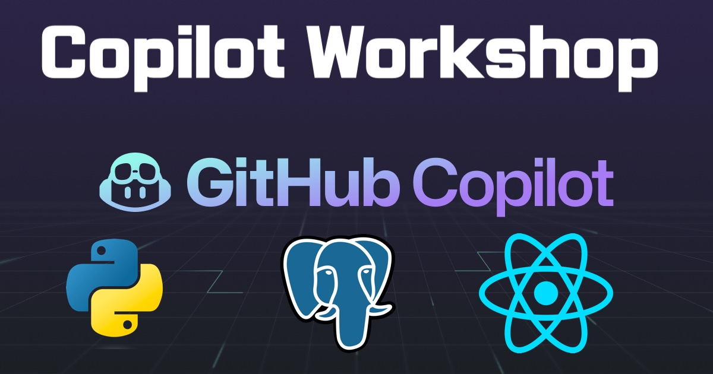

# Custom GitHub Copilot workshop with Python Django, ReactJS, and PostgreSQL stacks

Welcome to a custom Copilot workshop prepared by **GitHub’s Expert Service team**! 

In this workshop, you will get to deliver a custom Copilot workshop that can help to build a full stack web application that involves a front end layer using ReactJS, a backend layer using Python Django, and a database layer using PostgreSQL.

Because this workshop involves several technology stacks, it is essential that you need to meet prerequisites as outlined from [Before getting started](docs/2_BeforeGettingStarted/README.md) if you want to follow along. Otherwise, you can always listen to what GitHub Expert Service team's instructor demo to see how it works in practice.

Without further ado, let's get started.

## Table of Contents

1. [Story about Mona's dream to make her dream a reality](docs/1_Story/README.md)
2. [Before getting started](docs/2_BeforeGettingStarted/README.md)
3. [Build a PostgreSQL database layer using Docker container](docs/3_BuildPostgreSQL/README.md)
4. [Deploy the PostgreSQL package to GitHub Packages](docs/4_StoringPostgreSQLImageRegistry/README.md)
5. [Build a Python Django server with REST](docs/5_BuildPythonDjango/README.md)
6. [Build a front end layer with ReactJS](docs/6_BuildReactJS/README.md)
7. [Lessons Learned - Best practices, gotchas, etc](docs/7_LessonsLearned/README.md)
