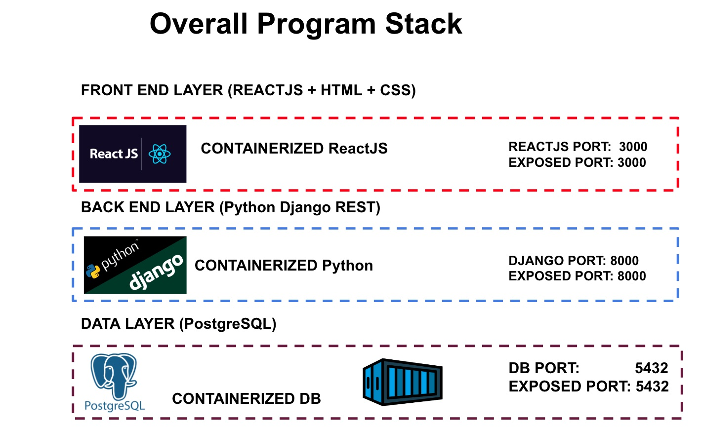
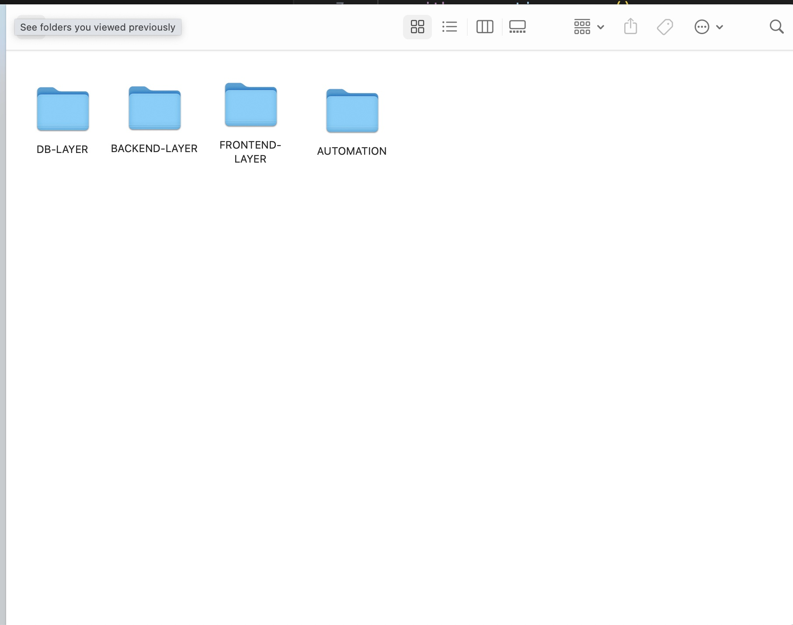

# Before getting started

[Prev - Story about Mona's dream to make her dream a reality](../1_Story/README.md.md) | [Next - Build a PostgreSQL database layer using Docker container](../3_BuildPostgreSQL/README.md)

## High Level View about what we will build

1. Build a PostgreSQL database layer using Docker container
2. Create a simple database connection script to check connection to PostgreSQL
3. Create a Python Django backend that connects to database and expose REST API
4. Create a ReactJS front end server that connects to Python Django’s REST
5. Deploy the application infrastructure layer (stretch goal)

## Right audience for this workshop:

This workshop should be ideal for customers who meets the following requirements:
- Either went through a basic Copilot 101 training or have familiarity with GitHub Copilot
- Prefer an advanced Copilot that involves a full web-end stack with Python Django, ReactJS, and a database layer

## Prerequisites

As a GitHub engineer who delivers this workshop, you should make sure that you have the following environments setup if you want to follow along.

- Access to Copilot license
- Access to Copilot Chat with Copilot for Business License
- Visual Studio Code with Copilot and Copilot Chat
- Docker with an ability to get base images from DockerHub
- You have Python and PIP installed on your computer and can install dependencies
- You have NodeJS installed
- Have Git CLI installed for Microsoft Windows or Termina with git for Mac or Linux

## Expected Outcomes

At the end of this workshop, you should be able to build a full stack web application that has a Python Django backend, ReactJS front end, and a PostgreSQL database layer with GitHub Copilot.

## Recommended setup

It is recommended that you created a separate parent folder with individual folders for each of the following components:
- `backend` - Python Django backend
- `frontend` - ReactJS frontend
- `database` - PostgreSQL database layer
- `automation` - Automation scripts to build the application infrastructure layer

[Prev - Story about Mona's dream to make her dream a reality](../1_Story/README.md) |  [Next - Build a PostgreSQL database layer using Docker container](../3_BuildPostgreSQL/README.md)
