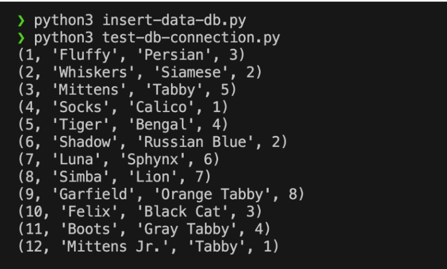

# Let’s build a PostgreSQL database layer

[Prev - Before getting started](../2_BeforeGettingStarted/README.md) |  [Next - Deploy the PostgreSQL package to GitHub Packages](../4_StoringPostgreSQLImageRegistry/README.md)

> In this example, you may want to start inside your DB-LAYER directory

Try to open **Visual Studio Chat** and enter the following in your GitHub Copilot Chat.


```bash
Can you help me to create a Dockerfile that helps to run on localhost with following conditions:

- Create a new PostgreSQL database table called “cats”. Name my SQL file as 'create-data.sql'
- Insert more than 10 random data representing different cats into the table named “cats”
```

This should generate some information including Dockerfile, a SQL script, and instruction on how to build and to run Dockerfile. First, try to create Dockerfile and `create-data.sql`` files using **Insert into New File** option


📝 **TIP:** 
> Once you created these files, you may want to make some random changes by deleting and adding some comments to see how Copilot can quickly generate some corrected data. For example, you may want to temporarily change cats to dogs in create-database.sql and remove the lines to insert the data into the database table. Then, write some comment like `Insert some 10 random data into the table`` and see how Copilot can generate data.

Next, you want to build the database using Dockerfile. Before building a Docker container, you want to inspect Dockerfile and make some changes. For example, you may want to modify database connection string (password, username, etc) as well as checking whether SQL file name is correct.

GitHub Copilot that may or may not show a Docker build command, but you may want to make sure to change the container name so it is meaningful. For example, I renamed it to `custom-database-layer`. Make sure to cd into the directory and execute inside the directory that has Dockerfile.

```bash
docker build -t custom-database-layer:1.0 .
```


You can then verify using the following command:

```bash
docker images
```

Copilot Chat should also show how to run the image. However, we want to add some additional options so it is easier to stop and to remove.

```bash
docker run -p 5432:5432 --rm --detach --interactive --name custom-database-layer -d custom-database-layer:1.0
```

Please refer to the [troubleshooting guide](../docs/TroubleshootingGuide) if you see any errors. If you see a process ID, you may want to check it is running with the following:

```bash
docker ps
```

Since the database layer is now working, we want to quickly check that the database is actually working. If you use Visual Studio Code, you can install an extension like PostgreSQL to retrieve the data like below:


But you can also quickly create a script to retrieve data or insert data. Type the following command in Copilot Chat.

```bash
Perfect. Can you help me to create a Python script that checks and prints data from local PostgreSQL?
```

This will generate a Python script file that can helps to connect to local PostgreSQL database. But before that, you need to install a dependency called `psycopg2-binary` that is used in the script.

📝 **TIP** 
> One of main issues that often happen with Copilot Chat is that lack of dependencies that are clearly defined and version incompatibility. This is one of the main areas that Copilot needs to get better and require developer’s knowledge.

```bash
pip install psycopg2-binary
```

You may need to run as pip3 if your environment is set differently. 


Now, create a test script with a file named `retrieve-data-db.py`


Once you created the file, take a look at it. You may have noticed that the database connection string did not get updated as specified from Dockerfile. You may want to update those with the right information.


And run the command. You may need to run python3 like I am.

```bash
python retrieve-data-db.py
```


But what if we want to test something else like inserting new data? Type the following command into the Copilot chat:

```bash
Can you help me to create a Python script to insert new data into the database table?
```

And it should generate a new Python script. Name it something like `insert-data-db.py` and run it to check. You may want to run `python test-db--connection.py` to make sure that data exists.



Before moving to the next step, here is one important thing to think about. Right now, we are running this as a local container, so it is alright to store those database credentials within the code itself. 

📝 **TIP:**
> This is a type of judgment that you have to make as a programmer to know what is right or wrong from a correctness perspective. Even if your code will work from a logical point of view, you have to know whether this is really effective, secure, ethical, and efficient. After all, you are the main pilot, and Github Copilot is just your assistant pilot.

However, if we later move those into a shared space, we want those credentials to be read from somewhere safe and be flexible. Thus, we need to change the credentials to be more secure. Type this into Copilot Chat:

```bash
What can I do if I want to replace database connection strings in Dockerfile with environment variables that can be read from somewhere else?
```

Then, a new Dockerfile with credentials changed to ARG will be printed out.


You can select all lines in Dockerfile and click **Insert at Cursor** in Copilot Chat to insert that Dockerfile.


However, this Dockerfile has an error. After every FROM statement, all the ARGs get collected and are no longer available. Be careful with multi-stage builds. Thus, you need to move ARG from before FROM to right below FROM.

Since we created a new Dockerfile, we need to rebuild our container. Let’s stop our container first.

```bash
docker ps
docker stop <PID>
```

Then, let’s rebuild our docker images with the following command:

```bash
docker build -t custom-database-layer:2.0 --build-arg POSTGRES_USER=admin --build-arg POSTGRES_PASSWORD=P@ssw0rd --build-arg POSTGRES_DB=cats_db .
```

Then, let’s run the image after checking with docker images

```bash
docker images

docker run -p 5432:5432 --rm --detach --interactive --name custom-database-layer -d custom-database-layer:2.0
```

Make sure to test connection again. We are successful!

Now, let’s move onto the next step.


[Prev - Before getting started](../2_BeforeGettingStarted/README.md) |  [Next - Deploy the PostgreSQL package to GitHub Packages](../4_StoringPostgreSQLImageRegistry/README.md)
