# Deploy the PostgreSQL package to GitHub Packages

[Prev - Let’s build a PostgreSQL database layer](../3_BuildPostgreSQL/README.md) |  [Next - Let's build a Python Django REST API backend](../5_BuildPythonDjango/README.md)

Last time, we built and ran a PostgreSQL database running on a local computer through a Docker container. However, we eventually want to distribute this with other team members and to deploy this application somewhere else so it can be accessible through a web application or a service.

Take a look at this architecture diagram before. Since we built our PostgreSQL client as a container, we can store this into a supported **image registry.**

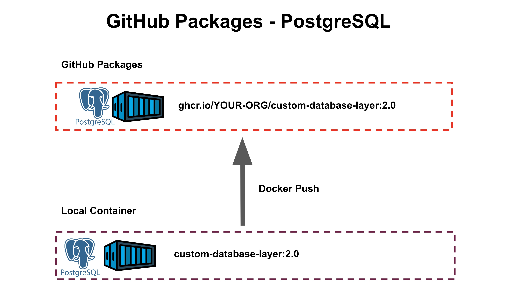

Image registry is a place where you can store shareable package files or libraries that can be used by other programming projects, deployed by things like DevOps automation, etc. Examples of image registries are JFrog Artifactory, Red Hat Quay, Azure Container Registry, Nexus Maven Registries, and GitHub Packages.

Since your team already has an enterprise GitHub organization, you can store this into GitHub Packages. Although you may prefer to store these packages somewhere else instead, it will be easiest to demonstrate through GitHub Packages, and the general process for other container image registry is almost the same.

In GitHub Copilot Chat, ask the following. Make sure to replace `REPLACE WITH YOUR ORG NAME``  with your organization name.

```bash
I have a local container named "custom-database-layer:2.0" in my local machine. How can I deploy this to the GHCR GitHub Packages registry in my organization "<REPLACE WITH YOUR ORG NAME>"?
```

Then, it will print out step-by-step instruction like this that can help to push your local PostgreSQL container image to your GitHub organization.

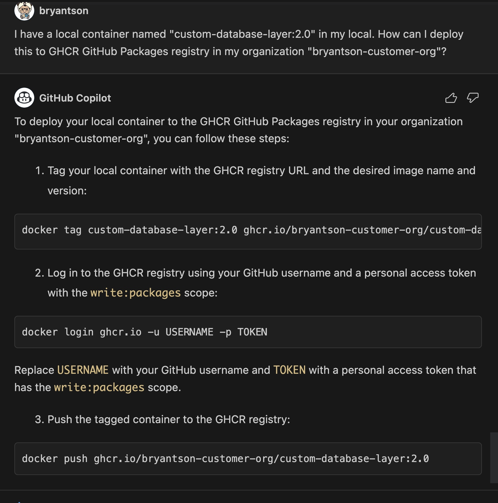

First step is to tag our local image with one to store in our own organization:

```bash
docker tag custom-database-layer:2.0 ghcr.io/YOUR-ORG/custom-database-layer:2.0
```

Then, you need to login to the GHCR registry. But as shown in the instruction, you need to create a PAT token with packages permission.

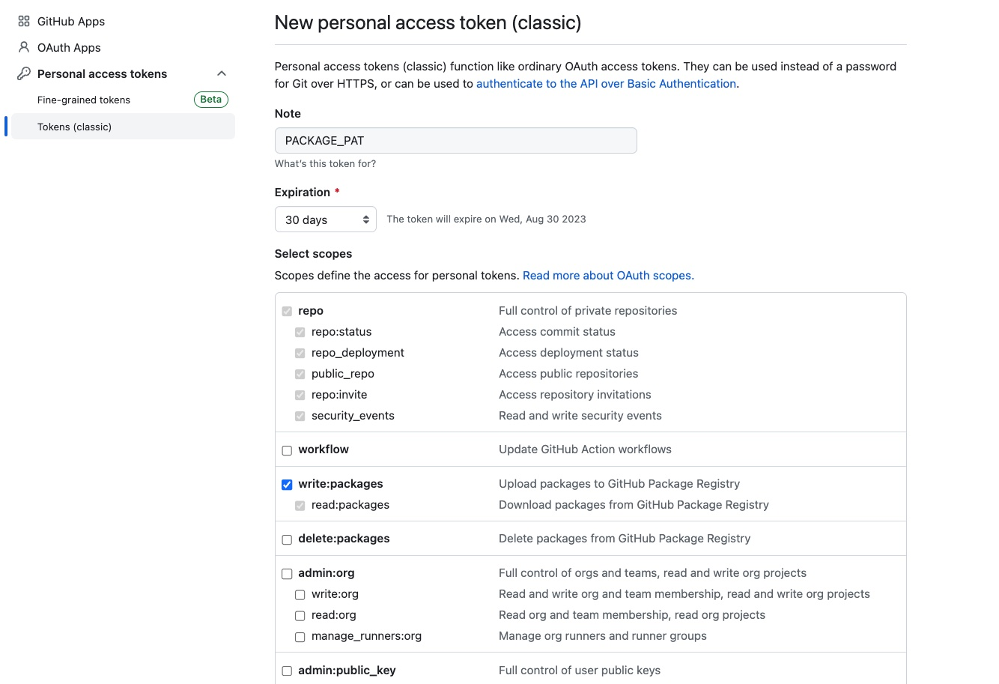

Then, you can login to the GHCR registry with the following command:

```bash
docker login ghcr.io -u USERNAME -p TOKEN
```

Once you are logged in, execute the docker push command.

```bash
docker push ghcr.io/YOUR-ORG/custom-database-layer:2.0
```

Now, you can see that your container image is stored in your GitHub organization's image registry.

But what if you want to automatically deploy your package? Let’s try to leverage GitHub Actions to automatically deploy our code. Let’s try to type this into chat:

```bash
Great. But, instead of building locally, can you help me to create a GitHub repository where GitHub Actions can automatically pick up "Dockerfile" and "create-data-sql" to build as a Docker container and push to my GitHub organization named "<REPLACE WITH YOUR ORG NAME>”'s GHCR GitHub Package container registry?
```

This will print out another series of instructions that asks you to create a new repository and store files.

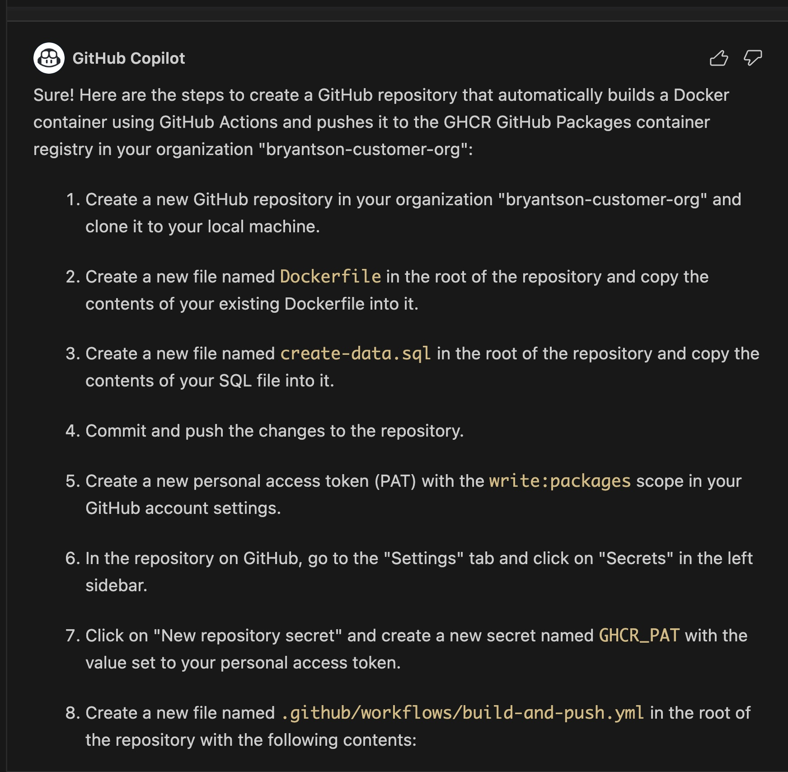

And your Action file may look like this. Notice that your build action does not take arguments for PostgreSQL database.

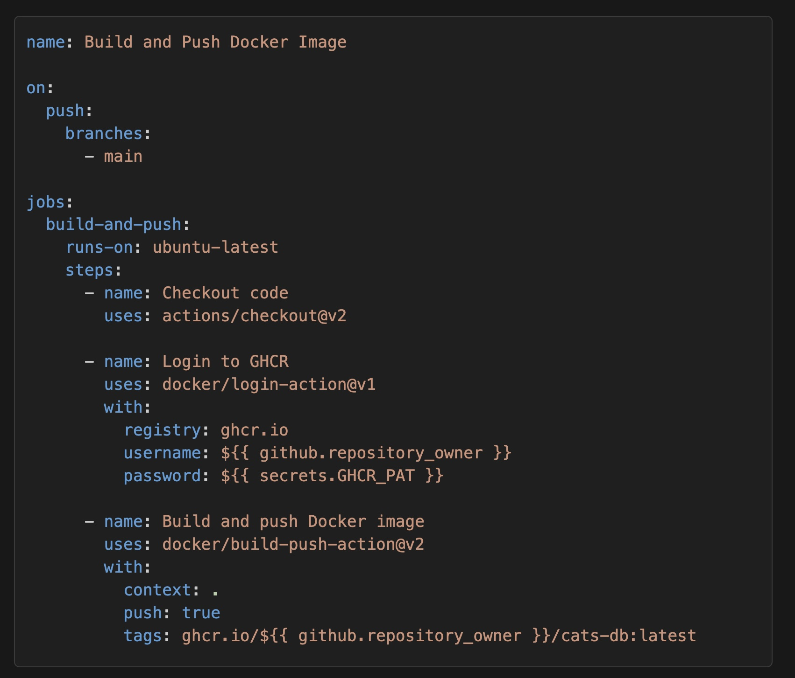

Let's proceed, though, first to create a repository first with instructions. Your repository might look like this.

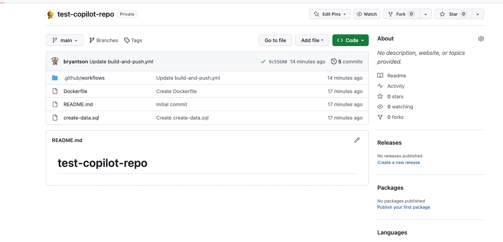

And if you execute the Actions, you now have a fully automated workflow to build your PostgreSQL.

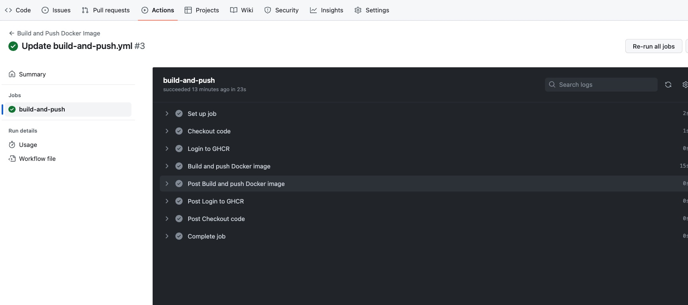

But remember that we had to provide custom `--build-arg` to build our PostgreSQL database. How can we do that?

Let's clone our repository and modify our Actions file to take arguments. If you created folder structures like what we show earlier, it might look like this. We will clone the repository under that **AUTOMATION** folder.

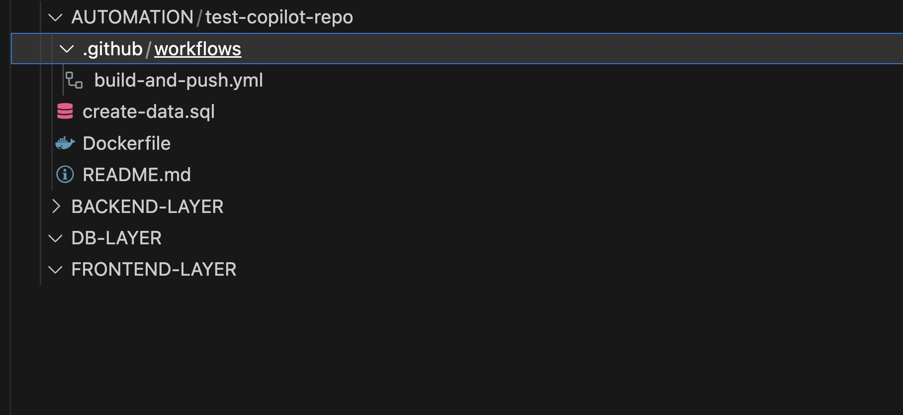

After you cloned, let's open that GitHub Actions workflow file under `.github/workflows` folder. You can open this with your favorite editor.

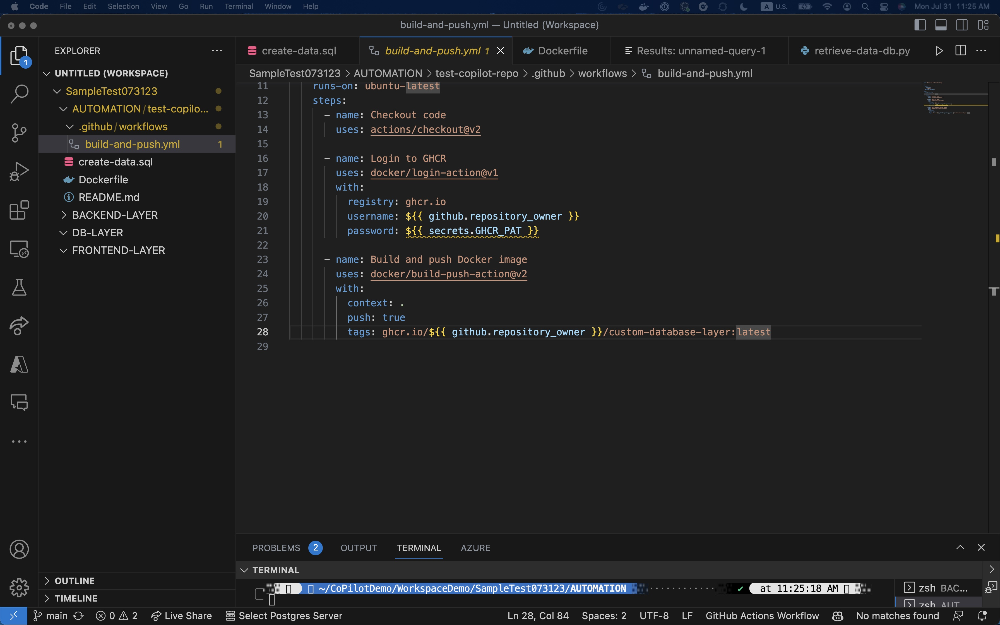

We need to add `--build-args` in that Action file, but how do we do that? [Let's visit the GitHub repository for that GitHub Actions called **build-push-action**](https://github.com/docker/build-push-action).

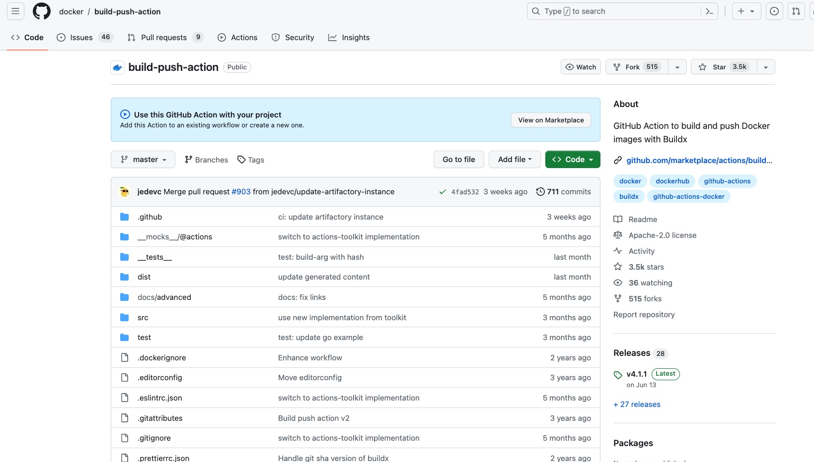

If you scroll down below, you should be able to see instructions for `build-args`.

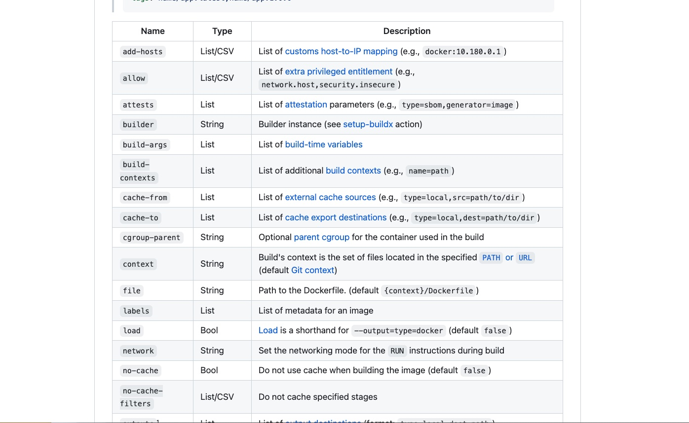

Of course, we could just ask GitHub Copilot, but we sometimes need to make our own decision to judge what is the best way to do it. Now, let's try to modify our GitHub Actions to include our custom build arguments.

As soon as you start typing, GitHub Copilot will be there to assist you.

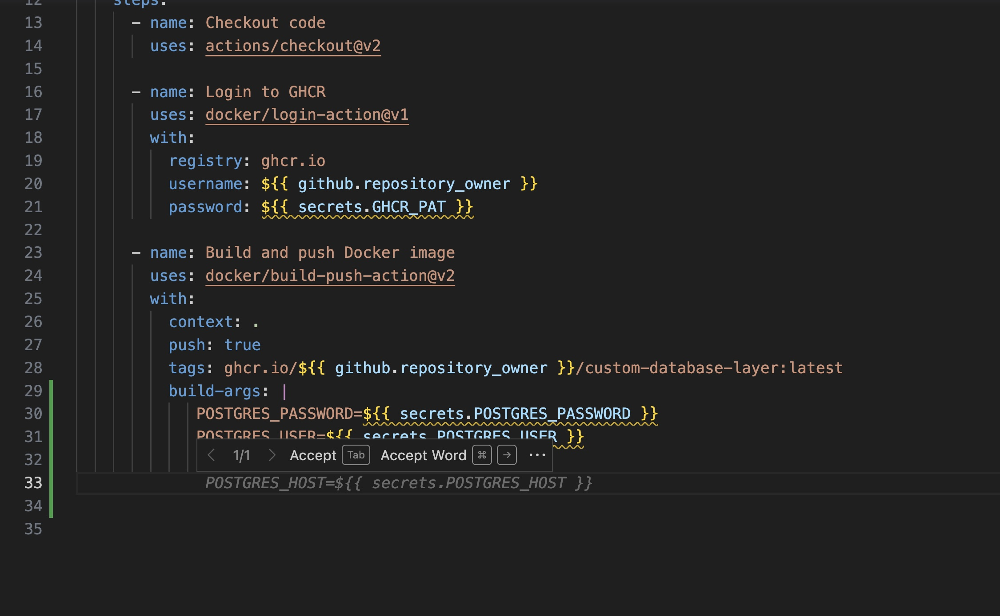

Your end result might look like this. Notice that we added `--build-arg` to the `docker build` command. In addition, we need to add those GitHub Secrets in our repository. But let's move on for now.

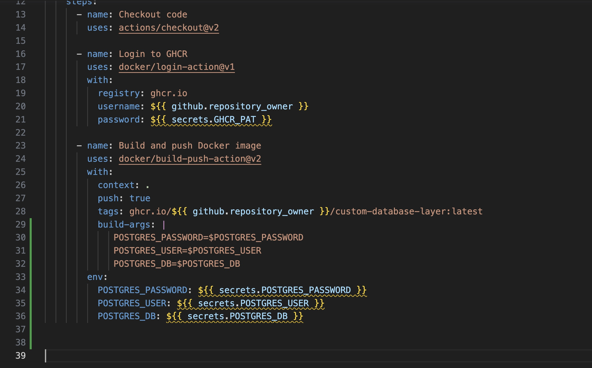

[Prev - Let’s build a PostgreSQL database layer](../3_BuildPostgreSQL/README.md) |  [Next - Let's build a Python Django REST API backend](../5_BuildPythonDjango/README.md)


