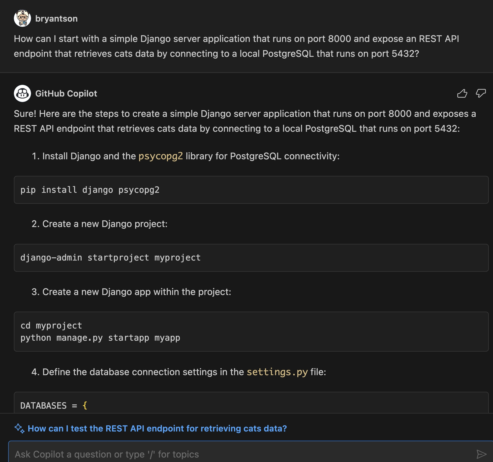
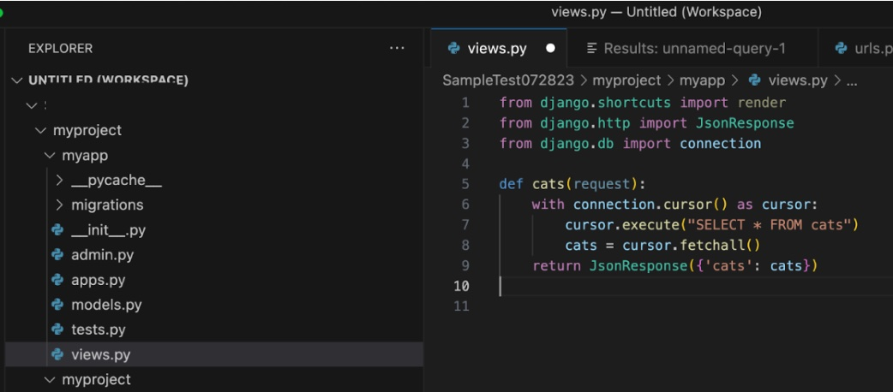
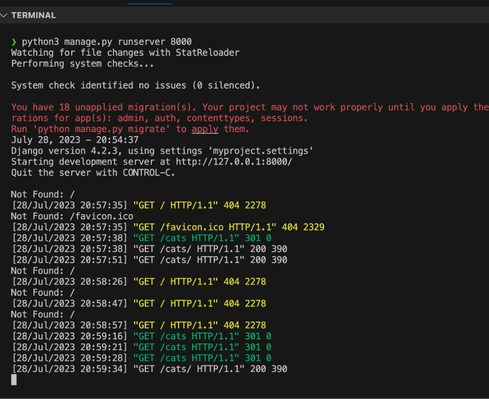

# Let's build a Python Django server with REST

[Prev - Deploy the PostgreSQL package to GitHub Packages](../4_StoringPostgreSQLImageRegistry/README.md) |  [Next - Build a ReactJS front layer](../6_BuildReactJS/README.md)

In the last stage, we built our PostgreSQL running inside a Docker container. In this time, we will try to build a simple Python Django server with REST API so it can retrieve and insert data.

> In this example, you may want to start inside your BACKEND-LAYER directory

Try to open **Visual Studio Chat** and enter the following in your GitHub Copilot Chat.

```bash
How can I start with a simple Django server application that runs on port 8000 and expose an REST API endpoint that retrieves cats data by connecting to a local PostgreSQL that runs on port 5432?
```

This will start generating some long instructions on how to build a Python dependency for a new Django server application, to create a new Django server application, to modify some Python files in the Django server application, and to start the Django server.



📝 **TIP** 
> Just like any thing that gets output with Copilot Chat, the result can vary depending on who enters it and how the message is communicated. You need to make your own judgment to see what works and what does not work. 

First step is to install dependencies. Again, you may have to change pip to pip3.

```bash
pip install django psycopg2-binary
```


📝 **TIP** 
> If you prefer, you can also convert that into requirements.txt file and run as pip -r requirements.txt to install all dependencies: pip freeze > requirements.txt

Next instruction says that you can create a new Django application with the following commands:

```bash
django-admin startproject myproject
```


This will create a structure like this:


Next, we need to `cd` inside `myproject` and create a new Python Django app.

```bash
# cd inside the project
cd myproject

# Create a new Django app
python manage.py startapp myapp
```

This will create a new directory called `myapp` inside `myproject` directory. You can see the structure like this:


Let’s start modifying our files. We need to make the modifications to three files as explained in Copilot:

- `myapp/views.py`
- `myproject/urls.py`
- `myproject/settings.py`

📝 **TIP** 
> Your result might be quite different from mine depending on how you communicate with Copilot. You may want to make some changes to see how Copilot can generate some code.

Let’s start with the `myapp/views.py`. You may want to copy instead of inserting this time because we want to compare.


Your `myapp/views.py` may look like this.



Next one is `myproject/urls.py`. Make sure to import cats.


You may have to replace cats URL to `cats/` like shown above because you will get an automatic attachment of `/` when you enter URL.

Last one is `myproject/settings.py`. We need to scroll down to find DATABASES data. Make sure to replace your own values for `NAME`, `USER`, and `PASSWORD`.


Lastly, run the server with the following commands:

```bash
python manage.py runserver 8000
```


Easiest way to check that the Django server is running is to paste the URL into the browser. We will get a page like this since we did not implement anything on our root page.


But if we paste with `http://localhost/cats/` , you will see a page like below:


However, it will be highly recommended to use a tool like CURL, Postman, or Insomniac especially to test API endpoints that require updating data.

Here is an example using CURL.


And here is an example using Insomniac. Since we are going to use Insomniac for the next step, you may want to [**install Insomniac**](https://insomnia.rest/download).


You can check any error with what gets printed out in the console.



So far, we only have an API endpoint that retrieves the data. We want to make it more interesting by introducing an API endpoint that can actually insert new data. This time, let’s use Copilot’s built in suggestion feature instead of Copilot Chat.

Go to `views.py` and start typing the following comment:

```bash
# Insert cat into database with user defined custom parameters. 
```

Then, it will give some suggestions like this.


You may need to make some changes such as field names.

If we can make a call to the Python Django server, we might encounter an error that is related to **CORS (Cross-Origin Resource Sharing (CORS))**, error. Thus, we need to add csrf_exampt by adding `@csrf_exampt` above our function and add library.


We also need to add URL to our `myproject/urls.py` like this.


Then, let’s restart our local Python Django server. Open your Insomnia or your HTTP client and create a POST call that sends the required data to `http://localhost:8000/insert_cats/`. You will get a result like this.


You can verify the result by either calling our retrieve-data-db.py or checking PostgreSQL client.


Before proceeding further, we need to make an adustment to our Python Django server so it can handle CORS exception. This is necessary because our API endpoint might not be accessible to our ReactJS front layer. We can do this by installing a library called `django-cors-headers` and adding it to our `INSTALLED_APPS` in `myproject/settings.py`.

Run the following command:

```bash
pip install django-cors-headers
```


Then, add `corsheaders` to `INSTALLED_APPS` in `myproject/settings.py`.


You also need to add `corsheaders.middleware.CorsMiddleware` to `MIDDLEWARE` in `myproject/settings.py`.


Next, add the following to `myproject/settings.py`. I added at the end of file.

```python
CORS_ORIGIN_ALLOW_ALL = False
CORS_ORIGIN_WHITELIST = (
       'http://localhost:3000',
)
```


Then, restart your Python Django server.

Awesome. Now, we are ready to move onto our final step to build a front layer using ReactJS.

[Prev - Deploy the PostgreSQL package to GitHub Packages](../4_StoringPostgreSQLImageRegistry/README.md) |  [Next - Build a ReactJS front layer](../6_BuildReactJS/README.md)
