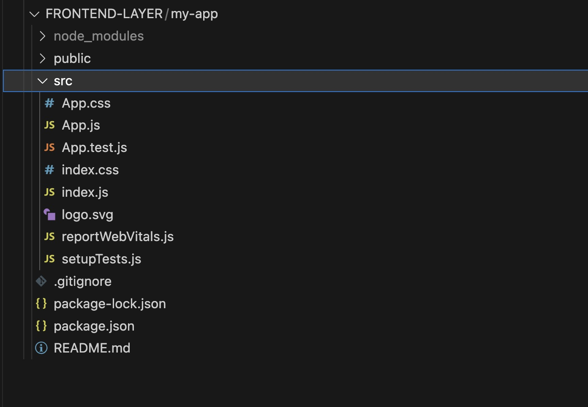

# Let's build a front end with ReactJS

[Prev -Let's build a Python Django server with REST](../5_BuildPythonDjango/README.md) |  [Next - Best practices and what we have learned](../7_LessonsLearned/README.md)

Last time, we created our backbone layers in Python Django server to retrieve the data from PostgreSQL database. In this time, we will create a ReactJS application that is going to communicate our Django server REST API. However, if we ask too many things first, we might not get the exact result that we want. Let’s start with a very simple step that can help us to get started with ReactJS projects from scratch and work our way from there.

> In this example, you may want to start inside your FRONTEND-LAYER directory

📝 **TIP**
> Visual Studio Code Chat is still in beta, so things will improve much better later on. However, as of right now, the more complex thing you ask for the first time, it might have a hard time figuring out what you exactly want the first time. It is better to start with something simple, make sure that it works, and builds your way from there.

Let's fire up your GitHub Copilot chat and ask this question.

```bash
Can you help to create a ReactJS application that runs on localhost 3000?
```


This will create a set of instructions, but your result might slightly differ. First thing is to create a new project with `npx` command. You can select Run in Terminal option from GitHub Copilot Chat.

```bash
npx create-react-app my-app
```

You can also click GitHub Copilot Chat's command and select **Run in Terminal** option.


This will create a new ReactJS project from scratch. Feel free to change the project name `my-app` to something else.


Next step is to `cd` into the directory.

```bash
cd my-app
```


Next, you can start the project with the following command.

```bash
npm start
```


This will start a local server in port `3000`, which is usually default for a front end server like ReactJS or NodeJS.


This will automatically open ReactJS application in your browser. But if it does not, you can visit `http://localhost:3000`. Your first ReactJS might look like this. Great!


Try to open your project and explore the contents. From there, let’s try to open file `App.js` under `src` folder.



Your current `App.js` might look like this. Although GitHub Copilot can figure out the context from an opened directory file, it can understand better if you have open files. We will try to make this `App.js` to work with our Python Django REST API to retrieve our cat data. 


Let's ask this following question in our GitHub Copilot Chat.

```bash
Can you help me to modify my ReactJS script so it can retrieve cat's data from a REST API endpoint that is available through http://localhost:8000/cats?
```


Highlight associated code lines in `App.js`. After that, you can select `App.js` and click **Insert at Cursor**. Try to save to automatically reload your ReactJS application. Visit `http://localhost:3000` again.

> WARNING: If you see an error like this, you need to configure **CORS** properly. Please follow the guideline earlier.


However, you will most likely encounter an error like this.


This error occurs because GitHub Copilot really does not understand what response gets returned by the endpoint. This is another type of decision that you have to make as a developer to figure out what will be the best for your application.

If you revisit what gets returned by our API endpoint at `http://localhost:8000/cats`, this might look like this: there are lists inside a list, though yours might look different than mine.


It would probably be better to store JSON data inside the list. In generate, you might have to go back to your Django file and create models around it to better marshall and to unmarshall the data. But for now, let’s work with what we have.

In `App.js` file, I made following changes:
- Under `useEffect()` function, chage `data` to `data.cats`
- When it gets printed out, print `{cat}` instead of `{cat.name}`


Then, when you save to reload your ReactJS web page, your updated ReactJS page might look like this.


We can further parse those data to make them look prettier, but, for now, let’s focus on whether we can put those data into a nice table instead of a simple list. Select those HTML tags that print the data, and let’s ask this question in our GitHub Copilot Chat.

```bash
How can I put those highlighted codes into a nice bootstrap table instead?
```


So, just like any GitHub Copilot's suggestion, you might or might not get a suggestion related to what libraries to install. For me, I did not. I asked the following question.

```bash
How can I install react-bootstrap?
```

Then, GitHub Copilot Chat gave an instruction on how to install `react-bootstrap`.

```bash
npm install react-bootstrap
```


You can always choose **Run in Terminal** option if you get that a suggestion.


Then, I followed the rest of instructions to move into the table.

One last step that I wanted to make is to replace that ReactJS logo with my own cat logo. So, I asked this question in GitHub Copilot Chat.

```bash
Can you help to replace that ReactJS logo with a cat logo?
```

This printed out a series of instruction as following. 


Then, when I reloaded my ReactJS after saving, I got something like this!


At this point, you might want to modify few other things like background color, update title, and adding buttons, etc. But as this workshop was mainly to use **GitHub Copilot** to build a full stack application, you should now have a good idea on how to proceed from this!

That is it for workshop. In next section, let's go over some what we have learned and some of best practices with GitHub Copilot.

[Prev -Let's build a Python Django server with REST](../5_BuildPythonDjango/README.md) |  [Next - Best practices and what we have learned](../7_LessonsLearned/README.md)